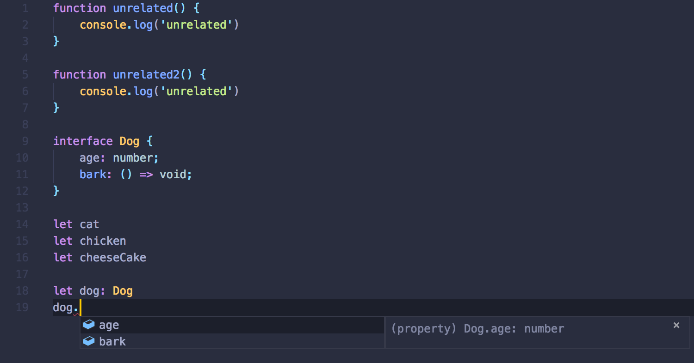
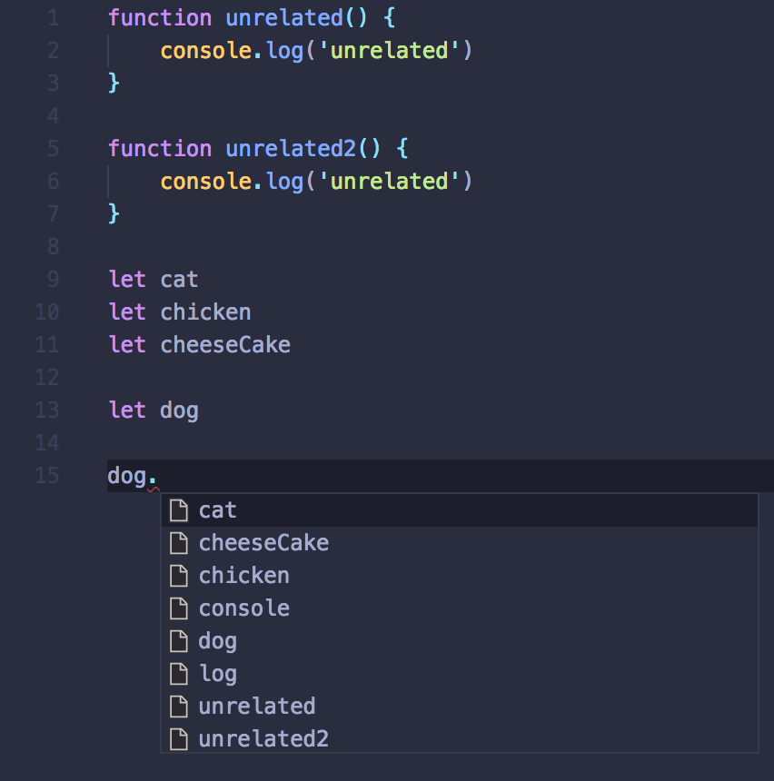

# 1.1 정적 타입 분석

타입은 프로그램의 ‘올바른 동작’이 무엇인지에 대한 프로그래머의 의도를 인코딩하는 수단이다.

프로그램의 타입을 분석하는 방식을 기준으로 프로그래밍 언어를 크게 둘로 나눌 수 있다. 바로 프로그램이 실제로 실행 될 때에 타입 분석을 진행하는 동적 타입 언어\(dynamically typed language\)와 프로그램을 실행해보지 않고도 런타임 이전에 진행하는 정적 타입 언어\(statically typed language\)다.

정적 타입 언어와 동적 타입 언어 중 어느 쪽이 더 우수한지에 대한 논쟁은 오래도록 이루어져왔고, 아직도 명확한 승자는 정해지지 않았다. 정적 타입 언어는 프로젝트 초기에 더 많은 노력을 필요로 하는 경향이 있다. 또한 요구사항이 정확히 정해지지 않았거나 빠르게 변하는 경우 \(프로토타이핑 등\) 적합하지 않은 도구일 수 있다.

**정적 타입 분석이 제시하는 장점은 시스템의 평균적인 복잡도가 늘어남에 따라 빛나기 시작한다**. 주요한 장점을 나열해보면 다음과 같다.

## **보다 빠른 버그 발견**

정적 타입 시스템은 **프로그램이 실제로 실행되기 전에 상당수의 오류를 잡아낼 수 있다**. 같은 종류의 오류가 동적 타입 언어에서는 코드 리뷰, 심지어는 실제 배포가 일어날 때 까지도 안 발견되는 경우도 잦다. 소프트웨어 개발 파이프라인에서는 오류가 늦게 발견 될수록 더 큰 금전적, 시간적 비용을 치루어야 하므로 이는 매우 큰 이점이다.

ICSE\(International Conference on Software Engineering\) 2017에 발표 된 “[To Type or Not to Type: Quantifying Detectable Bugs in JavaScript](http://earlbarr.com/publications/typestudy.pdf)”이란 논문은 깃허브\(GitHub\)의 공개된 버그를 이용해 정적 타입 시스템의 효과에 대해 다룬다.

연구진은 실험군으로 설정한 자바스크립트 코드의 버그 중 약 15% 정도는 정적 타입 시스템이 있었다면 커밋조차 되기 전에 잡혔을 것이라 결론짓는다. **실사용자가 맞닥뜨리는 버그 중 15%를 사전에 예방할 수 있다**는 인상적인 결과에 Microsoft의 한 엔지니어링 매니저는 다음과 같이 반응했다 한다.

> 충격적이다. 만약 개발하는 방식에 어떤 변화를 주어서 저장소에 들어오는 버그중 10% 이상을 줄일 수 있다면, 고민할 이유가 전혀 없다. 개발에 쓰이는 시간이 두 배 이상 늘어나는 수준이 아닌 한, 우리는 그 변화를 택할 것이다.

## **툴링**

소스 코드에 대한 정적 타입 분석이 가능하다면 **컴파일러 및 코드 에디터가 코드를 실행하지 않고도 프로그램에 대해 훨씬 더 많은 정보를 알 수 있다**. 그리고 이 정보는 코드 작성 과정에서 유용하게 사용 가능하다.

대표적인 예시가 바로 에디터의 자동 완성 기능이다. 만약 타입 시스템이 어떤 변수의 타입 정보를 정확히 안다면, 해당 변수의 멤버로 존재할 수 있는 변수만을 자동 완성 후보로 추천할 수 있다.



한편 타입 정보를 활용할 수 없는 상황에서는 데이터의 형태에 대한 확신을 가질 수 없다. 이 경우 에디터는 해당 파일에 존재하는 식별자를 전부 늘어놓는 식의 휴리스틱 기반 대안으로 만족하게 된다. 물론 이는 상황에 따라\(해당 객체의 형태가 코드 실행 전에 알려져있는가? 등\) 그리고 편집기의 성능에 따라 달라진다. 하지만 타입 정보가 있을 때 더 신뢰도 높은 추천 결과를 얻을 수 있단 사실은 명백하다.



그 외에도 정적 타입 분석을 이용해 프로그램을 더 잘 이해함으로서 다양한 편의기능을 구현할 수 있다. 일부 예시로 식별자의 정의로 바로 이동하는 기능\(Go to Definition\)이라던지 프로그램 전체에서 식별자의 이름을 바꾸거나 특정 코드 블록을 함수로 빼내는 등의 리팩토링 기능을 들 수 있다.

## **주석으로서의 타입**

마지막으로, 타입은 프로그래머의 의도를 기술하는 주석과 같은 역할을 한다. 이 때 타입은 보통의 주석에 비해 더 강력한데, **타입 검사기에 의해 검사 및 강제되므로 프로그램의 동작과 일정 수준 이상 괴리될 수 없기 때문**이다. 예를 들어 아래 코드를 보자.

```javascript
// 자기 자신을 리턴한다
function sum(a, b) {
  return a + b;
}
function concatString(a, b) {
  return a - b;
}
concatString("a", "b"); // NaN
```

위의 `sum`, `concatString` 함수는 각각 주석 또는 함수명을 읽고 추론할 수 있는 것과는 전혀 동떨어진 동작을 하고 있다. 하지만 이런 불일치에 불만을 가지는 건 프로그래머 뿐이다. 이 둘은 분명 유효한 자바스크립트 함수이며, 자바스크립트 실행기는 조금의 거리낌도 없이 이들을 실행할 것이다.

이런 상황이 생기는 원인은 주석과 변수명은 상대적으로 추상적인, 프로그램의 실제 동작과 직접 상호작용하지 않는 정보이기 때문이다. 반면 타입은 어떨까? 아래 타입스크립트 코드를 보자.

```typescript
type IdentityFunction = (a: number) => number;
const sum: IdentityFunction = (a: number, b: number) => {
    return a + b;
}
// error TS2322: Type '(a: number, b: number) => number' is not assignable to type 'IdentityFunction'.
function concatString(a: string, b: string): string {
    return a - b;
}
// error TS2322: Type 'number' is not assignable to type 'string'.
// error TS2362: The left-hand side of an arithmetic operation must be of type 'any', 'number' or an enum type.
// error TS2363: The right-hand side of an arithmetic operation must be of type 'any', 'number' or an enum type.
```

두 함수는 각각 함수 아래에 주석으로 적혀진 오류를 발생시킨다. 올바르지 않은 타입 정보를 가진 프로그램을 실행할 수단이 원천적으로 차단되는 것이다. 주석이나 변수명과는 다르게, **타입 정의와 다르게 동작하는 프로그램은 실행 자체가 불가능하다**는 점에서 타입은 앞서 언급된 다른 수단보다 훌륭한 명세 수단으로 동작한다.

## **자바스크립트와 정적 타입 분석**

자바스크립트는 기본적으로 동적 타입 분석을 채택한 언어이며, 그마저도 매우 미약한 수준이다. 때문에 아주 간단한 실수조차 실제로 코드를 실행 해 봐야만 잡아낼 수 있는 경우가 많다. 예를 들어, 아래 코드는 문자열을 써야 할 곳에 문자열이 아닌 객체를 사용하고 있다. 하지만 이런 간단한 오류조차 실제로 프로그램을 돌려 해당 코드가 실행되기 전에는 감지할 수 없다.

```javascript
const notString = { isString: false };
console.log(notString.substr(0, 1)); // TypeError: notString.substr is not a function
```

간단한 애플리케이션을 만들 때라면 모를까, 이런 동작은 프로젝트가 커짐에 따라 아주 큰 걸림돌이 된다. 자바스크립트가 갈수록 다양하고 복잡한 용도로 쓰임에 따라 자연스레 코드 작성에 정적 타입 검사를 도입하고자 하는 다양한 시도가 등장했다.

이 책의 주인공인 타입스크립트를 비롯해 서문에서 언급된 페이스북의 [Flow](https://flow.org/), 언어 수준에서 싱글 페이지 애플리케이션\(SPA\)을 기반에 두고 설계한 [Elm](http://elm-lang.org/), 하스켈의 영향을 크게 받은 [PureScript](http://www.purescript.org/), OCaml에 기반한 [ReasonML](https://reasonml.github.io/) 등이 대표적인 예다.

