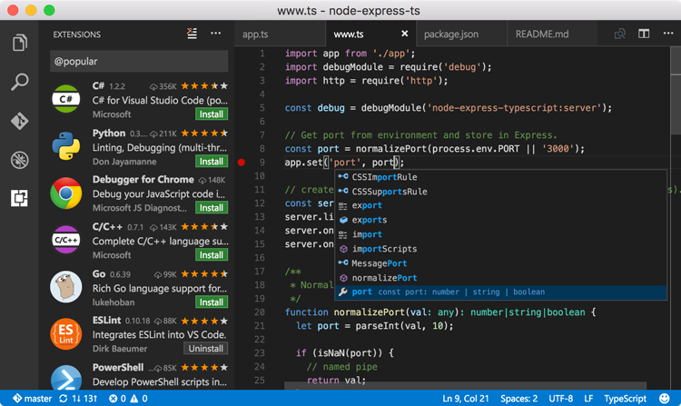
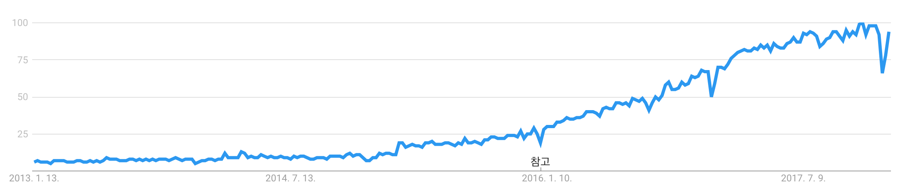

# 1.2 왜 타입스크립트인가

타입스크립트는 자바스크립트 개발에 정적 타입 시스템을 도입하고자 시도한 수많은 선택지 중 현재 가장 많은 사용자 커뮤니티를 갖고 있다. 과연 타입스크립트는 어떤 장점 덕분에 다른 경쟁자를 제치고 선두주자의 위치를 차지할 수 있었을까?

### **자바스크립트의 상위집합**

앞서 언급한 자바스크립트에 정적 타이핑을 도입한 시도 중 Elm이나 Reason, 또는 PureScript 등의 언어는 자바스크립트의 그것과는 상당히 이질적인 문법을 갖는다. 이러한 접근법은 자바스크립트의 문법에 얽매이지 않을 수 있다는 장점을 제공하지만, 다음과 같이 매우 명백한 단점 또한 따라온다.

* **기존 자바스크립트 코드베이스의 마이그레이션이 매우 비싸진다**. 전혀 다른 문법 탓에 사실상 프로젝트를 바닥부터 다시 작성하는 작업이 되기 때문이다.
* 기존 자바스크립트 프로그래머가 체감하는 **학습 곡선이 훨씬 가파라진다**. 이는 곧 직장 및 프로젝트를 위한 구인의 어려움으로 이어진다는 점에서 치명적이다.
* **서드파티 자바스크립트 패키지의 사용이 어려워진다.** 심한 경우 불가능 한 경우도 생긴다.

반면, 타입스크립트는 시작부터 수많은 기존 코드베이스와 생태계의 포용을 큰 우선순위로 두었다. 

**모든 자바스크립트 코드는 타입스크립트 코드다**. 때문에 타입스크립트 컴파일러는 확장자만 바꾸면, 심지어는 \(특정 옵션을 켠다면\) 확장자를 바꾸지 않고도, 자바스크립트 코드를 이해한다. 뿐만 아니라 타입스크립트는 최신 ECMAScript 표준 및 여러 유용한 프러포절\(부록 2 참조\)들을 지원한다.

이러한 접근을 통해 앞서 언급한 다른 접근법의 단점을 그대로 뒤집은 장점을 얻게 된다.

* **기존 자바스크립트 코드베이스의 마이그레이션에 드는 노력이 적다.** 
* **완만한 학습 곡선을 가지며 그 덕에 구인 또한 쉬워진다.**
* **서드파티 자바스크립트 패키지의 사용이 상대적으로 수월하다.**

### **트레이드오프**

타입스크립트 깃허브 위키에는 [TypeScript Design Goals](https://github.com/Microsoft/TypeScript/wiki/TypeScript-Design-Goals)라는 페이지가 있다. 이 문서는 타입스크립트를 만들며 목표로 삼았던 점\(Goals\)과 그렇지 않은 점\(Non-goals\)을 담고 있는데, 목표가 아닌 것들 중 흥미로운 항목이 있다.

> 안전하고 “증명 가능하게 올바른” 타입 시스템 적용하기. 그 대신 정확성과 생산성 사이의 균형을 노린다. _Apply a sound or "provably correct" type system. Instead, strike a balance between correctness and productivity._

안전하고 올바른 타입 시스템을 적용하는 것이 목표가 아니라는 점은 언뜻 듣기엔 비직관적이다. 안정성을 위해 정적 타입 시스템을 도입하는게 아니던가? **하지만 사실은 꼭 그렇게 말이 안 되는 이야기만은 아니다**.

아래 코드를 보자.

```typescript
function getFirstThreeCharsUnsafe(arg: { x: string | null }) {
    if (arg.x !== null) {
        window.alert('arg.x is string!');
        console.log(arg.x.substr(0, 3));
    }
}
```

3장에서 더 자세히 살펴보겠지만, 첫 줄의 `arg: { x: string | null }` 은 인자로 받는 `arg`에 `x`라는 필드가 존재하고, 해당 필드가 `string` 또는 `null` 타입이라는 의미이다. 함수 내부를 보면, 먼저 `arg.x` 가 `null`인지 여부를 체크한다. 만약 `null`이 아니라면 `arg.x`는 문자열이라 판단하고, 안심하고`String.prototype.substr`을 호출한다. 

별 문제가 없는 함수처럼 보이지만, 이 함수는 런타임 오류를 일으킬 수 있다. 다음 경우를 생각해보자.

```typescript
var a: { x: string | null } = { x: 'ok' };
window.alert = function (str: string) {
    a.x = null;
};
getFirstThreeCharsUnsafe(a);
```

위 코드는 **기존에 정의된** `window.alert` **함수를 덮어쓴다**. 새로 정의된 `window.alert`는 호출되는 순간 `a.x`를 `null`로 바꾸어버린다. `null` 에는 `substr` 메소드가 없으므로 `getFirstThreeCharsUnsafe` 내의 `arg.x.substr(0, 3)`가 불리는 순간 `TypeError: Cannot read property 'substr' of null` 오류가 던져진다. 타입 검사를 통과했음에도 런타입 오류가 발생하는 것이다.

이를 예방하기 위해선 `if` 블록 안에서도 함수가 하나라도 호출 된 시점에서, 해당 블록에 들어오게 한 조건문이 참일 것이라는 가정을 버려야 한다. 위 함수를 아래와 같이 다시 고치면 문제는 해결된다.

```typescript
function getFirstThreeCharsSafe(arg: { x: string | null }) {
    if (arg.x !== null) {
        window.alert('arg.x is string!');
        if (arg.x !== null) {
          console.log(arg.x.substr(0, 3));
        }
    }
}
```

런타임 오류가 발생할 수 있는 경로가 명백하므로 ‘안전한’ 타입 시스템은 `getFirstThreeCharsSafe` 처럼 함수 호출이 일어날 때마다 조건 검사를 다시 하도록 강제해야 한다. 실제로 [안전성을 최우선 과제로 천명한](https://flow.org/en/docs/lang/types-and-expressions/#soundness-and-completeness-a-classtoc-idtoc-soundness-and-completeness-hreftoc-soundness-and-completenessa) Flow는 `getFirstThreeCharsUnsafe`를 통과시켜 주지 않는다. 

하지만 위 예시에서 나타나듯, **이런 정책은 가능성이 매우 낮은 경우를 커버하기 위해 아주 자주 발생하는 패턴의 코드를 전부 장황하게 만든다**. 당장 작업중인 코드베이스의 `if` 문들을 살펴보고 이런 ‘안전한’ 타입 시스템이 통과 시켜 줄 코드가 얼마나 되는지 찾아보라!

타입스크립트는 이런 경우 안전함을 다소 희생하는 선택지와 프로그래머를 짜증나게 하더라도 안전성을 택하는 선택지 중 후자의 비용이 더 크다고 판단한다. 때문에 [이런 문제를 알고 있음에도 불구하고](https://github.com/Microsoft/TypeScript/issues/9998) `getFirstThreeCharsUnsafe` 와 같은 사용법을 허용한다.

이렇듯 타입 안정성을 일부 희생하면서 사용성을 극대화시키는 과감한 선택 덕에 **타입스크립트 사용자는 생산성의 희생 없이도 대부분의 경우 안전한 코드를 작성할 수 있다.** 타입스크립트가 트레이드오프가 발생했을 때 내린 구체적인 선택에 대해서는 이후 하나씩 살펴본다.

### **VS Code**

Visual Studio Code\(이하 VS Code\)는 Microsoft에 의해 개발되어 2015년 공개된 통합개발환경\(Integrated Development Environment, IDE\)이다. [The State of JavaScript 2017 통계](https://octoverse.github.com/)에 따르면 **응답자 중 가장 많은 수인 약 30% 가량이 VS Code를 사용한다**. Atom, Sublime Text 등의 다른 에디터에 비해 정식 출시가 가장 늦다는 점을 감안하면 상당히 고무적인 결과다. 

또한 VS Code는 수많은 활발한 컨트리뷰터를 갖고 있다. Octoverse 2017에 따르면 **2017년 깃허브 전체 저장소 중 가장 많은 사람이** **VS Code의 깃허브 저장소에 기여했으며, 해당 저장소에서는 전체 저장소 중 4번째로 많은 논의가 이루어졌다**고 한다.

이렇게 많은 이들의 사랑을 받는 VS Code는 모든 언어에 사용할 수 있는 IDE를 지향한다. 하지만 그 중에서도 VS Code와 타입스크립트가 갖는 관계는 특히 각별하다. 



저장소에서 가장 먼저 눈에 띄는 점은 코드 90% 이상이 타입스크립트로 작성되었단 점이다. 즉 **VS Code 개발팀은 타입스크립트 개발 환경을 개선할 만한 아주 강한 인센티브를 가진다.** 실제로 현 시점에서 VS Code는 다른 어떤 툴보다도 강력한 타입스크립트 툴링을 갖고 있다. 그 때문일까? VS Code의 릴리즈 노트에서는 자바스크립트/타입스크립트 관련 변경 및 개선 사항이 유독 많이 눈에 띈다.

뿐만 아니라, [타입스크립트](https://blogs.msdn.microsoft.com/typescript/)와 [VS Code](https://code.visualstudio.com/updates/)의 릴리즈 노트를 나란히 보면 종종 동일한 내용이 등장하는 것을 확인할 수 있다. 타입 정의 자동 설치 기능이 그 예시다. 이 기능은 2017년 10월 31일 [타입스크립트 2.6 릴리즈 노트](https://blogs.msdn.microsoft.com/typescript/2017/10/31/announcing-typescript-2-6/)에서 에디터가 곧 지원할 것이라는 코멘트 및 동작하는 버전의 gif 이미지와 함께 언급되었다. 그리고 얼마 후 2017년 11월 8일 [VS Code 1.18 버전 릴리즈](https://code.visualstudio.com/updates/v1_18)에 포함되었다. 

이렇듯, Microsoft가 관리하는 이 두 프로젝트는 아주 긴밀하게 연결되어 있다. 이 둘의 상생관계는 앞으로도 굳건히 지속될 것이며, 두 프로젝트와 그들을 둘러싼 생태계에게 긍정적인 영향을 끼칠 것이다.

### **커뮤니티**

마지막으로, 타입스크립트는 양과 질 모두 이미 검증된 커뮤니티를 갖고 있다.

먼저 정성적인 부분을 살펴보자. Microsoft, Google, Palantir, [Reddit](https://redditblog.com/2017/06/30/why-we-chose-typescript/), [Slack](https://slack.engineering/typescript-at-slack-a81307fa288d), [Tumblr](https://javascript.tumblr.com/post/165082071937/flow-and-typescript), [Lyft](https://eng.lyft.com/typescript-at-lyft-64f0702346ea?gi=373fbd34acaf) 를 비롯한 세계 유수의 기업이 타입스크립트를 사용한다. 공식 홈페이지의 [Friends Of TypeScript](https://www.typescriptlang.org/community/friends.html)에서 더 많은 기업을 확인할 수 있다. 특히 구글의 경우 타입스크립트를 공식 언어로 채택했고 Google Analytics, Firebase, and Google Cloud Platform 등 다양한 구글 제품에서 사용하고 있다고 [2017년 4월에 밝힌 바 있다](http://angularjs.blogspot.kr/2017/04/official-languages-at-google.html). 

VS Code를 비롯해 웹 프레임워크 [Angular](https://github.com/angular/angular), 자바스크립트용 ReactiveX 라이브러리 [RxJS](https://github.com/ReactiveX/rxjs), 그래픽스 프레임워크 [Babylon.js](https://github.com/BabylonJS/Babylon.js), GraphQL 클라이언트 [Apollo Client](https://github.com/apollographql/apollo-client) 등이 타입스크립트로 작성되었다. 분야를 막론하고 다양한 거대 규모 프로젝트에서 이미 사용되고 있는 것이다.

Google Trends를 통해 [근 5년간의 “타입스크립트” 주제의 시간 흐름에 따른 관심도 변화](https://trends.google.com/trends/explore?date=today%205-y&q=%2Fm%2F0n50hxv)를 살펴보면, 그 관심도가 꾸준히 성장해 왔으며 성장세가 꾸준히 빨라지고 있음을 확인할 수 있다.



다음으론 정량적인 부분을 살펴보자. 보다 와닿는 비교를 위해 두 번째로 많은 사용자군을 갖는 Flow와 지표들을 대비한 표를 만들어 보았다. \(모든 숫자는 2018년 1월 기준\)

|   | Flow | TypeScript |
| --- | --- | --- | --- | --- | --- | --- |
| Stack Overflow 질문 개수 | [1,132](https://stackoverflow.com/questions/tagged/flowtype) \(flowtype 태그\) | [45,315](https://stackoverflow.com/questions/tagged/typescript) \(typescript 태그\) |
| GitHub 저장소 이슈 개수 | [1,884 Open / 2,472 Closed](https://github.com/facebook/flow/issues) | [2,503 Open / 12,782 Closed](https://github.com/Microsoft/TypeScript/issues) |
| GitHub 저장소 PR 개수 | [106 Open / 1,223 Closed](https://github.com/facebook/flow/pulls) | [121 Open / 5,875 Closed](https://github.com/Microsoft/TypeScript/pulls) |
| npm 월별 다운로드 수 | [852,756](https://www.npmjs.com/package/flow-bin) | [8,393,830 ](https://www.npmjs.com/package/typescript) |
| 외부 타입 정의 개수 | [429](https://github.com/flowtype/flow-typed/tree/master/definitions/npm) | [4,010](https://github.com/DefinitelyTyped/DefinitelyTyped/tree/master/types) |
| 내부 타입 정의 개수 | [~2,000](https://github.com/search?utf8=%E2%9C%93&q=flow+extension%3A.flow+size%3A%3E10) | N/A |

Stack Overflow 질문 개수나 GitHub의 이슈 및 풀 리퀘스트 개수, npm 월별 다운로드 수 모두 타입스크립트가 압도적으로 많다. 특히 GitHub 이슈 및 풀 리퀘스트의 경우 전체 양이 크게 차이나는데에 비해 열려 있는 이슈 및 풀 리퀘스트의 차이는 상대적으로 적다는 점에서 타입스크립트 쪽이 더 활발하게 처리되고 있음을 짐작할 수 있다.

“외부 타입 정의 개수” 항목의 경우 Flow와 타입스크립트가 각각 라이브러리의 타입 정보를 저장하기 위해 관리하는 [flow-typed](https://github.com/flowtype/flow-typed) 와 [DefinitelyTyped](https://github.com/DefinitelyTyped/DefinitelyTyped) 저장소를 기준으로 했다. 라이브러리가 플랫폼이 해석할 수 있는 타입 정보를 제공하지 않는다면 사용자의 선택지는 두 가지다. 직접 타입 정보를 작성하는 것과 해당 라이브러리를 사용하지 않는 것이다. 두 선택지 모두 자명하게 불편함을 초래하므로 타입 정의의 수는 해당 플랫폼의 사용자 경험과 직결된다.

타입스크립트와 Flow 모두 외부 저장소 대신 라이브러리 내부에 타입 정보를 직접 포함하는 방법을 제공하는데, “내부 타입 정의 개수” 항목은 이렇게 직접 포함된 타입 정의의 수를 의미한다. Flow의 경우 해당 용도로 사용되는 `.flow` 확장자를 가지며 내용이 비어 있지 않은 파일이 약 2천 개 정도 존재했다. 타입스크립트의 경우 GitHub 검색의 한계와 더불어 `node_modules` 파일을 전부 커밋한 저장소가 너무 많아 신뢰할만한 수를 얻기 어려웠지만, 다른 지표들로 미루어보아 내부 타입 정의의 수 역시 Flow보다 많을 것으로 추정한다.

